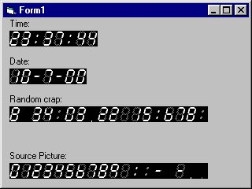



## Digital Display

### Description

learn how to use the "PaintPicture" function on the picture box. Learn how to "paint" certain parts of a picture box to another.

leet stuff.
 
### More Info
 

             |
---                |---
**Submitted On**   |2000-10-07 23:32:04
**By**             |[Andrew Heinlein \(Mouse\)](https://github.com/Planet-Source-Code/PSCIndex/blob/master/ByAuthor/andrew-heinlein-mouse.md)
**Level**          |Beginner
**User Rating**    |4.0 (24 globes from 6 users)
**Compatibility**  |VB 4\.0 \(32\-bit\), VB 5\.0, VB 6\.0
**Category**       |[Graphics](https://github.com/Planet-Source-Code/PSCIndex/blob/master/ByCategory/graphics__1-46.md)
**World**          |[Visual Basic](https://github.com/Planet-Source-Code/PSCIndex/blob/master/ByWorld/visual-basic.md)
**Archive File**   |[CODE\_UPLOAD104921082000\.zip](https://github.com/Planet-Source-Code/andrew-heinlein-mouse-digital-display__1-11943/archive/master.zip)

